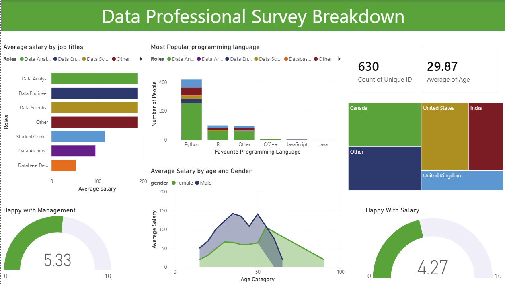

# 📊 Data Professional Survey Breakdown Dashboard

An interactive Power BI dashboard built to analyze responses from a survey of data professionals. This project explores salary trends, programming language preferences, demographic insights, and employee satisfaction using Power BI and Power Query.

---

## 📌 Project Overview

The goal of this project is to analyze survey responses from professionals working in the data industry and uncover insights related to:

- Average salaries across different data roles
- Most popular programming languages
- Salary trends by age and gender
- Geographic distribution of survey participants
- Employee satisfaction with salary and management

The dashboard enables users to interactively explore these insights through dynamic visualizations.

---

## 🛠️ Tools & Technologies

- **Power BI Desktop**
- **Power Query** (Data Cleaning & Transformation)
- **DAX** (Measures & Calculations)
- **Microsoft Excel** (Source Dataset)

---

## 📂 Dataset

**File:** `Professional_survey_original_dataset.xlsx`

The dataset contains survey responses from data professionals, including:

- Job Title
- Country
- Age
- Gender
- Salary
- Favorite Programming Language
- Satisfaction with Salary
- Satisfaction with Management

---

## 🧹 Data Cleaning (Power Query)

The dataset was cleaned and transformed using Power Query before visualization.

### Data Preparation Included

- Removed unnecessary columns
- Checked for missing values
- Corrected data types
- Renamed columns for readability
- Standardized categorical values
- Prepared data for reporting and analysis

---

## 📈 Dashboard Features

### 💼 Average Salary by Job Title
Compares the average salary across various data-related roles such as:

- Data Analyst
- Data Engineer
- Data Scientist
- Database Developer
- Data Architect
- Student / Looking for Work
- Other

---

### 💻 Most Popular Programming Languages

Visualizes the programming languages preferred by survey participants.

Languages include:

- Python
- R
- SQL / Database
- JavaScript
- Java
- C/C++
- Others

---

### 🌍 Geographic Distribution

Treemap showing survey responses from different countries including:

- Canada
- United States
- India
- United Kingdom
- Other Countries

---

### 👥 Salary by Age and Gender

Compares average salary across age groups for male and female professionals.

---

### 😊 Employee Satisfaction

Gauge visuals displaying:

- Satisfaction with Salary
- Satisfaction with Management

Both scored on a scale of **0–10**.

---

### 📌 Key Metrics

- Total Survey Respondents
- Average Age of Participants

---

## 📊 Key Insights

- Python is the most popular programming language among survey participants.
- Data Scientists and Data Engineers report some of the highest average salaries.
- The majority of responses come from North America.
- Overall satisfaction with management is higher than satisfaction with salary.
- Salary trends vary across age groups and between genders.

---

## 📷 Dashboard Preview

```markdown

```

## 🚀 How to Use

1. Clone this repository.
2. Open the `.pbix` file using **Power BI Desktop**.
3. Refresh the dataset if required.
4. Interact with the visuals and filters to explore the survey insights.

---

## 🎯 Skills Demonstrated

- Data Cleaning with Power Query
- Data Modeling
- DAX Measures
- Data Visualization
- Dashboard Design
- Business Intelligence
- Data Storytelling

---

## 👨‍💻 Author

**Mukul Chandela**

Aspiring Data Analyst

- SQL
- Python
- Excel
- Power BI
- Tableau
- Pandas
